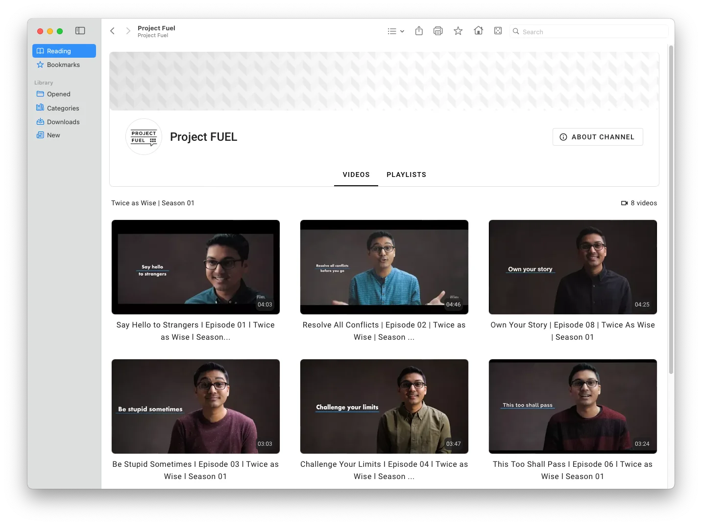

# Google Summer of Code 2024 - Kiwix

During the summer of 2024, I participated in [Google Summer of Code](https://summerofcode.withgoogle.com/) (GSoC) with [Kiwix](https://kiwix.org/), working on a project titled **YouTube UI Revamp**. This document outlines the initial tasks, changes made throughout the project, developments achieved, and work that remains to be done.

## About Kiwix

[Kiwix](https://kiwix.org/) is primarily an NGO dedicated to bringing internet content to everyone. To achieve this, Kiwix offers free and open-source offline web browsing, allowing users to download content in the form of [ZIM](https://wiki.openzim.org/wiki/ZIM_file_format) files and access it through [reading apps](https://kiwix.org/en/applications/) for offline viewing.

## Project Description

This project aims to improve the [Kiwix YouTube Scraper](https://github.com/openzim/youtube), which is designed to create ZIMs from YouTube videos. By enhancing the user interface for YouTube ZIMs, the goal is to create a more visually appealing and user-friendly design, making educational videos and other content more accessible for Kiwix users worldwide.

## Work Done
The merged pull requests for the project can be viewed [here](https://github.com/openzim/youtube/pulls?q=is%3Apr+author%3Adan-niles+is%3Amerged+).

The task was a large 350-hour project to revamp the UI for the Kiwix YouTube Scraper. The scraper operates by taking a channel or playlist ID, scraping the content from the internet, and packaging it into a ZIM file - a format that essentially contains a mini website, accessible via Kiwix readers.

Previously, the scraper used Jinja HTML templates to render each page of the YouTube channel. The goal of this revamp was to replace that approach with a Vue.js UI, offering a more user-friendly and minimal design.
